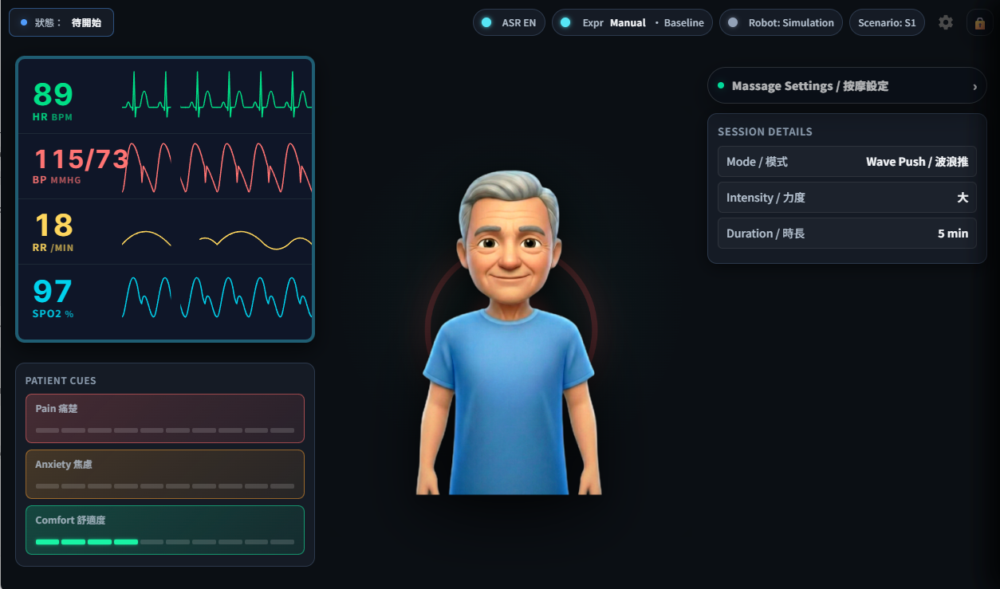

# Massage Robot Teaching Platform Stable

Stable ASR virtual patient teaching platform for massage robot simulation and UR10e-connected teaching sessions.

## UI Screenshot



## Quick Setup After Clone/Pull

```bash
git clone <repo-url>
cd massage_robot_teaching_platform
./build.sh
```

`build.sh` prepares the local runtime:

- creates or updates `venv`
- installs Python dependencies from `requirements.lock.txt` (Python 3.12 on Linux)
- installs Node dependencies with `npm ci`
- installs Playwright Chromium for E2E tests
- creates `.env` from `.env.example` if `.env` is missing

For a faster setup without Playwright browser download:

```bash
./build.sh --skip-playwright
```

To install dependencies and run unit/scenario tests:

```bash
./build.sh --with-tests
```

## Local Configuration

Copy `.env.example` to `.env` and fill local API keys. Do not commit `.env`, certificates, logs, or runtime pid files.

Default port is `5033`. You can override it in `.env`:

```bash
PORT=5033
HOST=127.0.0.1
```

The server binds to loopback by default. Set `HOST` explicitly for access from
another computer. The control API needs authentication and a protected network
before shared access; the instructor PIN and browser origin checks do not provide
API authentication. Set `AUTO_CONNECT_RTDE=0` to disable automatic robot connection,
or `MASSAGE_SIMULATION_MODE=1` for an explicitly simulated teaching session.

## Start

```bash
./start.sh
```

To run the server directly, activate the same environment used by `start.sh`:

```bash
source venv/bin/activate
python3 main.py
```

Both commands serve the same dashboard and voice setup runtime. Use the URL
printed at startup; `main.py` reads the configured `PORT` from `.env`.

Default local URL:

```text
http://127.0.0.1:5033/
```

## UR10e Robot Program

Load `robot/ur10e_demo_smooth_27.urs` into the pendant program with the RG2
URCap helpers available. After updating this file, reload it on the pendant;
restarting the backend does not update the robot's loaded script.
This is the repository's only `.urs` program. The backend requests actions via
RTDE registers and does not load script files from the repository automatically.

The backend captures its home pose after a confirmed stationary Stop and preserves
it across reconnections to the same robot. Mode 4 saves the starting TCP pose once
per start command. Every station and
return lift uses that same TCP reference frame, and each completed batch returns
to the exact starting pose without endpoint blending. Physical lift is TCP -Z
for the downward-facing tool used by this demo. Confirm the selected TCP matches
the installed tool before positioning the starting pose.

The demo currently maps commands 1–4 to the mode-4 movement sequence.

For a connected demo, open the UI at `http://127.0.0.1:PORT/` on the server
computer (or use HTTPS on another computer), allow microphone access, and click
once if the browser requests it. Connect to the pendant IP in Settings, then
keep the host program PLAYING in PolyScope. RTDE connectivity alone does not
mean the host program is running.

The dashboard shows a compact robot warning badge to the left of ASR for invalid force readings
(NaN/Infinity), stale telemetry, controller errors, safety stops, and connection
failures. Hover for a summary or click the badge for affected force components
and the next step. Voice
settings remain selected after a rejected Start, and Stop remains available.
Health updates run every five seconds; the warning clears when the reported
problem clears, without automatically starting the robot. Restart the backend
and reload the browser after updating to enable the full measurement diagnostics.

Voice recognition uses the Cantonese command profile by default, which accepts
the Cantonese and English commands used by this demo. Settings' Voice Response
Language controls spoken response audio only; selecting English no longer
changes recognition to an English-only profile. The ASR indicator shows both
languages, and previously saved voice-language preferences do not change ASR.

During voice setup, mode, intensity, and duration selections give visual feedback
after an interim result settles for 200 ms. The current question stays in place
until final recognition commits the selection and plays the next spoken prompt.
Revised interim results update the preview without advancing setup. Duplicate
finals and corrections within a step do not replay its prompt.
Hiding and reopening the setup drawer, repeating the wake phrase, or restarting
recognition preserves completed steps; a new setup begins after cancellation.
Start and Resume still require final recognition, while Stop uses interim results.
Spoken Cancel (English) and 取消 (Chinese) close setup and restore its saved
settings on interim recognition, interrupt pending guidance, and play a
cancellation response in the selected response language. Delayed final cancel
results neither reopen setup nor repeat the response.

Current demo behavior:

- The UI's intensity selection does not change the RG2 gripping force: the demo
  uses its script constants and the UI sends `force_assist: false`.
- The controller enforces the selected duration (1–1800 seconds) independently
  of the browser. Paused time does not consume that duration. The browser also
  sends Stop when its timer expires.
- A backend heartbeat changes double input register 21 every 250 ms. If it stops
  changing for 3 seconds during motion, pause, or home return, the updated script
  cancels the action, requests gripper release, and disarms without return travel.
  This is separate from integer register 21, which carries session duration.
- The force guard checks the magnitude of all three force axes during arm,
  gripper, and return actions. A force fault also releases and disarms without
  recovery travel. These guards require controller and hardware validation.
- An unconfirmed robot Stop leaves the UI session active for retry. Automatic
  reconnection sends Stop and resynchronizes command sequences; it does not
  resume massage automatically. The browser also observes confirmed controller
  completion and safety faults without issuing another travel command.
- A normal Stop can initiate the existing home-return path. Stop acknowledgement
  means the massage action was interrupted; `return_home_pending` and controller
  state 3 indicate that return travel is still in progress. A new Start is rejected
  while running, paused, or returning home.
- The backend preserves the pendant speed slider. Live speed and duration changes
  are unsupported and return errors. Calibration and jog commands require a host
  script that implements them; the bundled demo rejects those commands.
- Spoken Stop is handled on interim recognition, including "please stop". It
  interrupts pending Start requests and bypasses ordinary backend operations.
  The host script polls Stop/Pause every 20 ms while arm or gripper actions run,
  cancels their worker, stops the arm, and requests gripper release for Stop.
  Recognition, network transport, and physical deceleration still take time.
  After updating, restart the backend, reload the browser, and replace the
  pendant's script with `robot/ur10e_demo_smooth_27.urs` before pressing Play.

## Stop

```bash
./kill_all.sh
```

## Tests

```bash
npm test
AUTO_CONNECT_RTDE=0 ENABLE_AZURE_SPEECH_STT=false venv/bin/python -m unittest discover -s tests -p 'test_*.py' -v
PATH="$PWD/venv/bin:$PATH" PORT=15033 TEST_START_SERVER=1 npm run test:e2e -- --workers=2
```

The browser command starts an isolated server with robot auto-connect and cloud
speech disabled. Without `TEST_START_SERVER=1`, E2E tests use the existing server
selected by `TEST_URL` or the configured port.

The reliability workflow runs Python, JavaScript, scenario, browser, and dependency
audit checks on pushes and pull requests. The robot tests execute control flow
with simulated poses and RTDE interfaces; they do not compile the script in
PolyScope or validate controller dynamics and physical movement.

Read the [deep reliability review](docs/reviews/2026-10-07-reliability.md) for the
fixes, remaining risks, and required controller/hardware acceptance checks.
